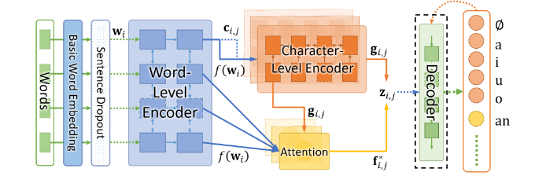

# Pipeline Architectures

We implemented **two main pipeline architectures**:

1. **Pipeline A — Character-Level Sequential Models**
2. **Pipeline B — Hierarchical Word + Character Model with Attention**

---

# **Pipeline A — Character-Level Encoder + Diacritic Classifier**

This pipeline treats the task as a sequence labeling problem at the character level.

---

## **1. Data Preprocessing**

### **1.1 Data Cleaning**

We removed all characters outside the allowed vocabulary:

- Arabic letters
- Arabic diacritics
- Spaces
- Standard punctuation
- Padding symbol

Any invalid tokens (HTML tags, English characters, digits, unsupported Unicode symbols) were stripped.

### **1.2 Sentence Tokenization**

We split each sentence into smaller segments based on punctuation to reduce excessively long sequences and stabilize LSTM gradients.

### **1.3 Character/Diacritic Separation**

Each Arabic character was decomposed into:

- **Base letter**
- **Associated diacritic** (or PAD if none)

This enabled independent modeling of diacritics as categorical labels.

### **1.4 Encoding**

We performed:

- **Character encoding:** `letter → ID`
- **Diacritic encoding:** `diacritic → ID`
- **Sequence padding:** fixed-length representation for batching

---

## **2. Feature Extraction**

We implemented and evaluated several feature families:

### **2.1 Trainable Embeddings (BiLSTM / BiLSTM-CRF / CNN-CRF)**

- Learned jointly with the model during training
- Embedding dimension tuned experimentally (128–256)

### **2.2 Skip-gram Word Embeddings (CRF Model Only)**

Skip-gram was used in the pure CRF model to provide word-level distributional semantics.

Hyperparameters:

- Embedding dim: 100
- Window size: 5
- Workers: 4
- Min count: 1
- Epochs: 10

### **2.3 CNN Character Encoder** _(for CNN-CRF model)_

We extracted n-gram-like morphological features using a shallow CNN:

- Kernel sizes: (2, 3, 4)
- Filters per kernel: configurable
- ReLU activation + max-pooling

### **2.4 HMM Features**

For the HMM model, we computed:

- **Initial probabilities**
- **Transition probabilities** between diacritics
- **Emission probabilities** `p(letter | diacritic)`

These were estimated directly from the training corpus.

---

## **3. Models**

We trained four main models under Pipeline A.

---

### **3.1 Bidirectional LSTM**

A standard sequence labeling model using only trainable embeddings.

#### **Hyperparameters**

- Embedding dim: 128
- Hidden dim: 256
- Layers: 3
- Dropout: 0.2
- Batch size: 32
- Epochs: 5
- Learning rate: 0.001

---

### **3.2 Conditional Random Field (CRF)**

Uses skip-gram embeddings + handcrafted contextual features.

##### **Skip-gram hyperparameters**

- Embedding dim: 100
- Window size: 5
- Min count: 1
- SG = 1 (skip-gram)
- Epochs: 10

#### **CRF hyperparameters**

- Algorithm: L-BFGS
- C1: 0.1 (L1 regularization)
- C2: 0.1 (L2 regularization)
- Max iterations: 100
- Context window: ±2 characters

---

### **3.3 CNN-CRF Model**

Combines CNN character encoder + skip-gram embeddings + CRF inference.

### **Characteristics**

- CNN extracts morphological features
- CRF ensures valid label transitions

### **Skip-gram & CRF hyperparameters are the same as the other model**

### **CNN hyperparameters**

Character embedding dimension: 30
Number of convolution filters: 50
Kernel sizes: 2, 3, 4
CNN output dimension: 150
Batch size: 512

---

### **3.4 Bidirectional LSTM-CRF**

This hybrid model adds a CRF decoding layer on top of the BiLSTM output, allowing explicit modeling of dependencies between consecutive diacritics.

#### **Hyperparameters**

Same as BiLSTM **except**:

- Batch size: 128
- Epochs: 6

This model ultimately achieved the best performance.

---

### **3.5 Hidden Markov Model (HMM)**

A baseline generative model trained using:

- Initial probability estimation
- Transition matrix
- Emission matrix

Inference performed using Viterbi decoding.

---

# **4. Pipeline B — Hierarchical Word-Level + Character-Level Model with Attention**

## **4.1 Overview**

Pipeline B implements the **D2 (Two-Level Diacritizer)** architecture from the paper _"Effective Deep Learning Models for Automatic Diacritization of Arabic Text"_. Unlike Pipeline A which processes text character-by-character, this architecture separates word-level and character-level processing.

**Key insight / Intuition:** Diacritization requires both local morphological features (within-word patterns) and global syntactic context (cross-word dependencies like grammatical agreement).

---

## **4.2 Preprocessing Differences**

### **Sliding Window Segmentation**

- Sentences are split into overlapping segments of **Ts = 10 words** with **stride = 5** (Hyperparameter we experimented with)
- Creates more training examples and handles variable-length sentences uniformly

### **Word-Level Tokenization**

- Text is tokenized at the word level (not just characters)
- Words below **min_freq = 2** are mapped to `<UNK>`
- Separate vocabulary built for words vs characters

### **Character-Diacritic Separation**

- Same as Pipeline A: each character paired with its diacritic(s)
- Combined diacritics (e.g., shaddah + vowel) mapped to one of **15 classes**

---

## **4.3 Feature Extraction**

### **Trainable Word Embeddings**

- Dimension: **128**
- Learned jointly during training
- Captures distributional word semantics

### **Trainable Character Embeddings**

- Dimension: **32**
- Captures morphological patterns within words

### **Contextual Word Features (BiLSTM)**

- Word embeddings processed by **2-layer Bidirectional LSTM**
- Hidden dimension: **256** (×2 for bidirectional = 512)
- Output: contextual word representations

### **Contextual Character Features (BiLSTM)**

- Character embeddings **concatenated with parent word context**:
- Processed by **3-layer Bidirectional LSTM**
- Hidden dimension: **512** (×2 = 1024)
- Output: contextual character representations

### **Cross-Level Attention Features**

- Scaled dot-product attention over word encodings
- For each character, attends to **all other words** (current word masked)
- Captures long-range syntactic dependencies (e.g., case agreement from prepositions)

---

## **4.4 Model Architecture**

### **Components**

| Component    | Specification                                          |
| ------------ | ------------------------------------------------------ |
| Word Encoder | 2-layer BiLSTM, hidden=256, word_dropout=0.2           |
| Char Encoder | 3-layer BiLSTM, hidden=512, input=[char_emb; word_ctx] |
| Attention    | Scaled dot-product, Q=char, K/V=words, self-masked     |
| Classifier   | Linear(1024 → 15 classes)                              |

### **Training Hyperparameters**

| Parameter      | Value                                      |
| -------------- | ------------------------------------------ |
| Batch size     | 128                                        |
| Learning rate  | 0.002                                      |
| Optimizer      | Adam                                       |
| LR scheduler   | ReduceLROnPlateau (factor=0.5, patience=1) |
| Dropout        | 0.25 (vertical), 0.2 (word/input)          |
| Early stopping | 3 epochs patience                          |

For all stages hyperparameters check the notebook config.

### **Regularization Techniques**

- **Sentence Dropout (0.2):** Randomly zeros word embeddings during training
- **Vertical Dropout (0.25):** Between LSTM layers
- **Input Dropout (0.2):** On character encoder inputs

---

## **4.5 D2 Experiments**

| Exp # | Accuracy | CE Accuracy | Word LSTM Layers | Char LSTM Layers | Word Hidden | Char Hidden | Dropout | Word Dropout | Batch Size | LR    | Max Words | Stride | Notes           |
| ----- | -------- | ----------- | ---------------- | ---------------- | ----------- | ----------- | ------- | ------------ | ---------- | ----- | --------- | ------ | --------------- |
| 1     | 96.1     | 92.8        | 2                | 2                | 256         | 512         | 0.25    | 0.2          | 32         | 0.002 | 10        | 5      | Baseline config |
| 2     | 95.0     | 93.0        | 2                | 2                | 256         | 512         | 0.25    | 0.0          | 32         | 0.002 | 10        | 5      | No word dropout |
| 3     | 96.87    | 95.0        | 2                | 3                | 256         | 512         | 0.25    | 0.2          | 32         | 0.002 | 10        | 5      | +1 char layer   |
| 4     | 81.0     | -           | 2                | 5                | 256         | 512         | 0.25    | 0.2          | 32         | 0.002 | 10        | 5      | Overfitted      |
| 5     | 96.98    | 94.77       | 2                | 3                | 256         | 512         | 0.25    | 0.2          | 128        | 0.002 | 20        | 15     | Larger batch    |
| 6     | 96.97    | 94.81       | 2                | 4                | 256         | 512         | 0.25    | 0.2          | 128        | 0.002 | 20        | 15     | +1 char layer   |
| 7     | **97.2** | **95.37**   | 4                | 4                | 256         | 512         | 0.25    | 0.2          | 128        | 0.002 | 15        | 15     | **Best**        |

### **Best D2 Model Results**

| Metric                     | Value      |
| -------------------------- | ---------- |
| Overall Accuracy           | **97.20%** |
| Case Ending Accuracy       | **95.37%** |
| DER (Diacritic Error Rate) | **2.80%**  |

**Best configuration:** 4-layer Word BiLSTM, 4-layer Char BiLSTM, batch=128, max_words=15 (with no overlap between segments)

---

## **5. Evaluation**

## **5.1 Accuracy Evaluation Template**

### **Accuracy (Case Ending)**

| Model      | Accuracy |
| ---------- | -------- |
| BiLSTM     | 95.69    |
| CRF        | 83.82    |
| CNN-CRF    | 85.17    |
| BiLSTM-CRF | 95.75    |
| HMM        | 45.81    |
| D2 Model   | 95.37    |

---

### **Overall Performance**

| Model      | Accuracy |
| ---------- | -------- |
| BiLSTM     | 97.73    |
| CRF        | 82.33    |
| CNN-CRF    | 83.67    |
| BiLSTM-CRF | 97.80    |
| HMM        | 61.41    |
| D2 Model   | 97.20    |

## **6. Final Model Selection**

We selected the **Bidirectional LSTM-CRF** model as our final submission.

## **Reasons for selection**

- It achieved the **highest accuracy** among all tested models.
- It obtained the **lowest Diacritic Error Rate (DER)**.
- CRF decoding significantly reduced invalid or unlikely diacritic sequences.
- Better generalization to rare diacritics and complex morphological patterns.
